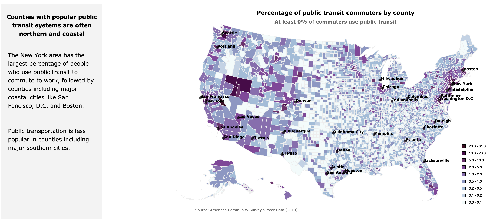
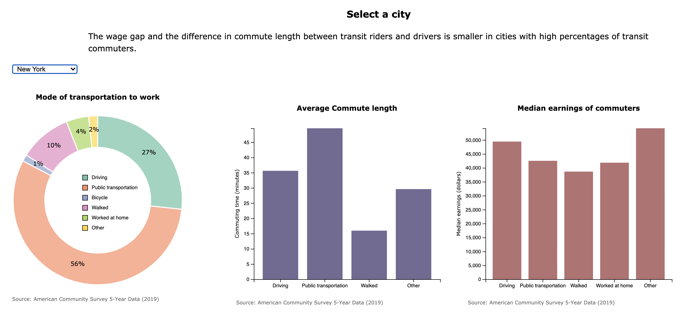

# Dynamic Project: Public Transport and inequality in the U.S 

## Project overview

This project uses dynamic visualizations to illustrate the relationship between public transportation services and inequality.

## Libraries and Tools

This folder provides an example project that uses modern javascript tooling.

All visualizations were built using d3. The scrollytelling seccion was built using Scrollama.

## Deployment: GH Pages

gh-pages is a wonderful resource for doing web-development, and allows you to have classy YOU_PERSONAL_DOMAIN/projectname type links.  

To see the project go to: https://stephramos.github.io/dynamic-proyect-transit-d3/